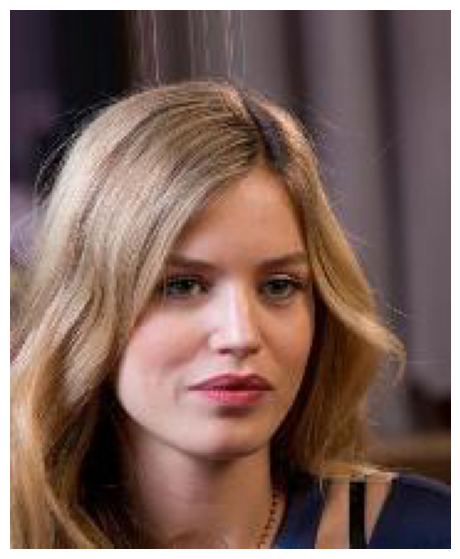

# bert-multi-label-classification

This notebook finetunes a pre-trained BERT multi label classification model using a dataset generated over the celeba dataset features.

It generates a synonyms dictionary for the list of attributes in the celeba face images dataset and uses it to generate a corpus of 10000 sentences for training.

We use the Trainer class by Huggingface to finetune the model for 10 epochs after splitting the dataset into training and validation sets to ensure we're not overfitting.

Lastly we tested the final model on a sentence and used the resulting feature vector to fetch an image from the celeba dataset.

The sentence in this case was: 
### "A beautiful blonde woman with wavy hair, glasses, lipstick, and a necklace"

Returned Features:

### ['Attractive', 'Blond_Hair', 'Wavy_Hair', 'Wearing_Lipstick', 'Wearing_Necklace']

Retreived Image:

